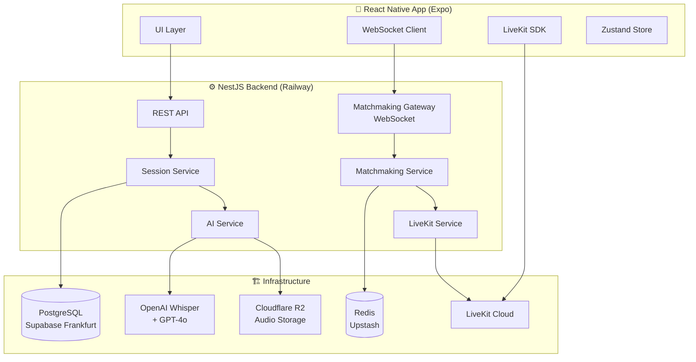
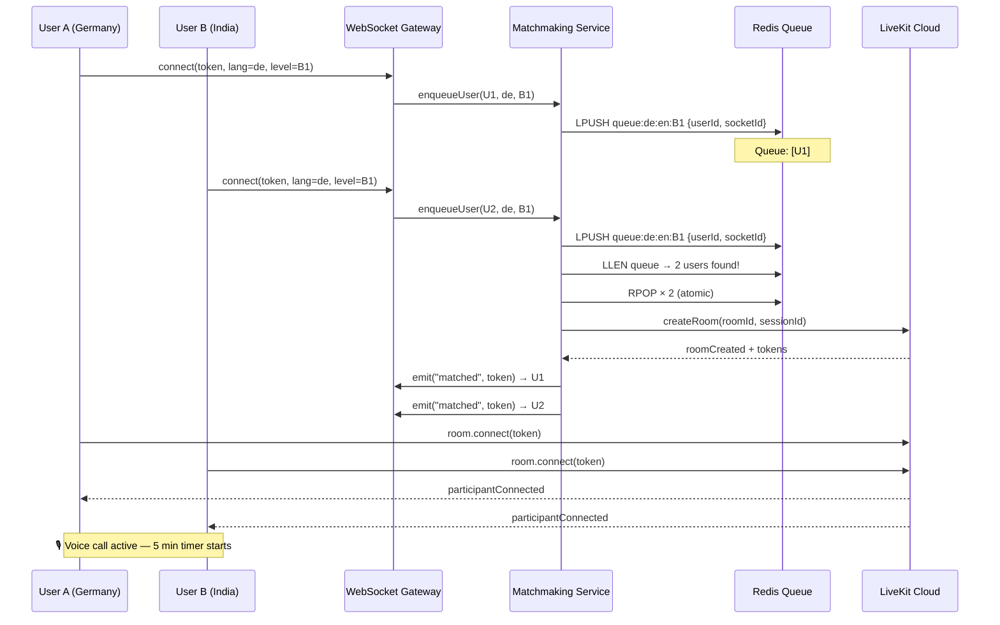
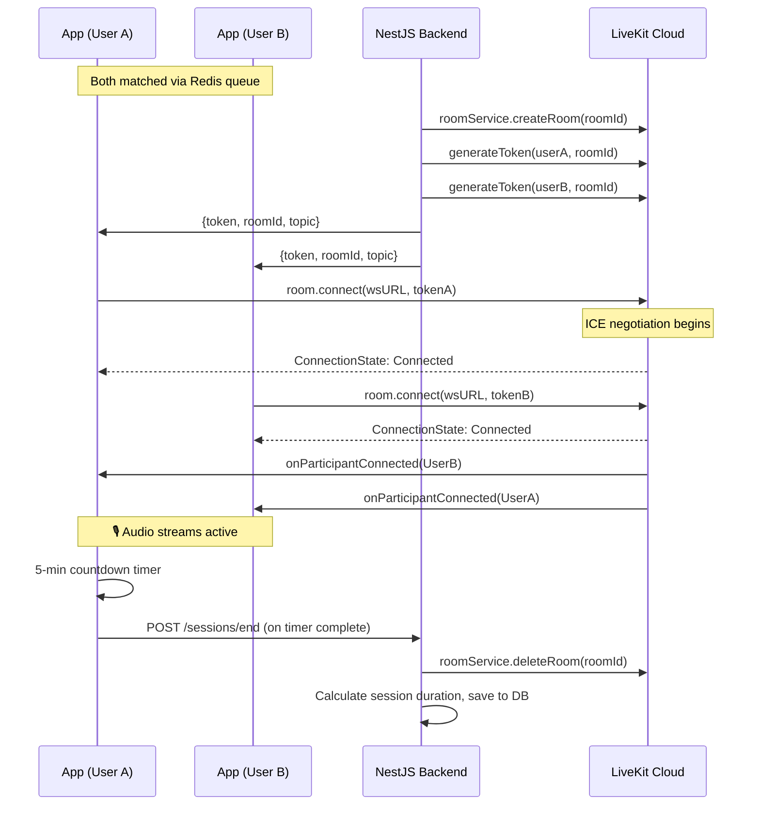
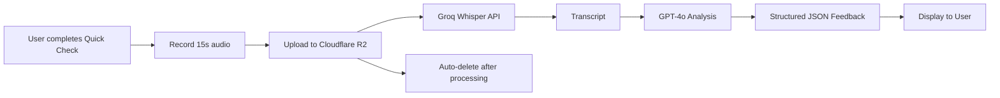
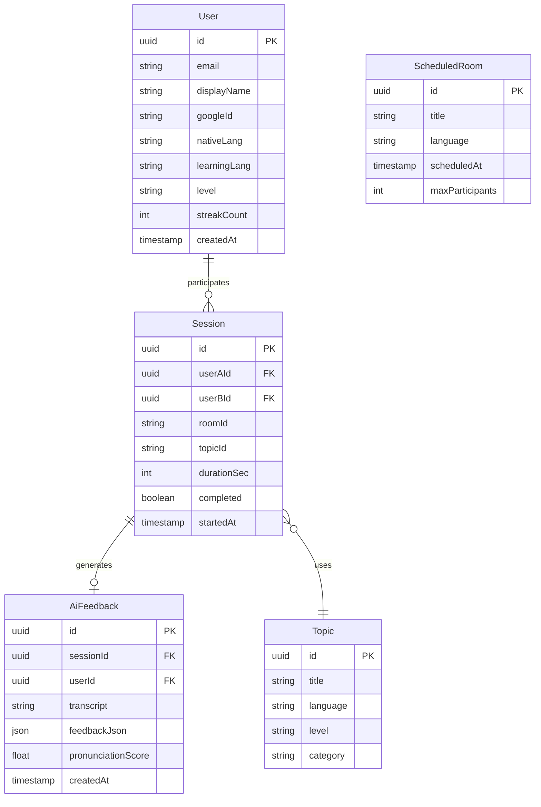

# Vocaa — Speak. Connect. Grow.

[](https://vocaapp.vercel.app)
[](https://play.google.com/store)
[](https://nestjs.com)
[](https://reactnative.dev)
[](https://supabase.com)
[](https://livekit.io)
[](https://railway.app)

> **Real-time language speaking practice — with real humans, not AI bots.**

**Live:** [vocaapp.vercel.app](https://vocaapp.vercel.app) · **Play Store:** Closed Testing (Android) · **Founder:** [Saurabh Kumar](https://saurabhmauryaa.com)

Vocaa solves the hardest problem in language learning: finding someone to actually *speak* with. Press one button, get matched with a real human in under 2 seconds, and practice for 5 minutes. No scheduling, no AI chatbots, no awkward cold messages — just instant human connection with AI-powered feedback after every session.


---

## Problem & Solution

### The Problem

Most language learners plateau at intermediate level — not because they lack grammar knowledge, but because they never practice speaking. Existing solutions fail them:

| Solution | Problem |
|---|---|
| Duolingo, Babbel | No real speaking. Gamified grammar. |
| iTalki, Preply | Expensive tutors. Scheduling friction. |
| HelloTalk, Tandem | Text-heavy. Hard to find available partners. |
| AI conversation bots | No real human unpredictability. No social pressure. |

Language learners in Germany — immigrants, expats, students — need to speak German *today*, not after booking a session for next Thursday.

### My Approach

Vocaa is built on one insight: **the fastest path to fluency is forced, repeated speaking with real humans under time pressure.**

- **Instant matching** — under 2 seconds via Redis queue
- **Real humans only** — no AI conversation partners
- **5-minute sessions** — low commitment, high frequency
- **AI feedback after** — Whisper transcription + GPT-4o analysis
- **Topic cards** — eliminate awkward silences
- **Daily streaks** — build habit

---

## System Architecture

### High-Level Architecture



### Matchmaking Data Flow




---

## Tech Stack — Why I Chose Each

### Backend: NestJS over Express

```
Decision: NestJS (TypeScript, modular, decorator-based)
Rejected: Express.js, Fastify
```

**Why:** Vocaa's backend has clear domain boundaries — Auth, Matchmaking, Sessions, AI Feedback, LiveKit integration. NestJS's module system enforces this separation at compile time. Dependency injection makes testing and mocking trivial. The WebSocket gateway (`@WebSocketGateway`) integrates seamlessly with the REST layer without separate server setup.

Express would have worked, but NestJS forced me to write production-grade architecture from day one.

### Database: PostgreSQL via Supabase

```
Decision: PostgreSQL (Supabase, Frankfurt region)
Rejected: MongoDB, PlanetScale, raw RDS
```

**Why PostgreSQL over MongoDB:** Session data, user relationships, and topic assignments are inherently relational. JOINs are the right tool. Document databases would have forced me to denormalize and maintain consistency manually.

**Why Supabase:** Row-Level Security (RLS) out of the box, built-in auth (unused but available), and Frankfurt region for EU data residency — critical for GDPR compliance when serving German users. Connection pooling via PgBouncer (port 6543) handles Railway's connection limits gracefully.

### Redis: Upstash for Matchmaking Queue

```
Decision: Upstash Redis (serverless, Frankfurt)
Rejected: Self-hosted Redis, Elasticache
```

**Why Redis for matchmaking:** The queue must be atomic. If two users press "Practice" simultaneously, only one pair should form. Redis `RPOP` is atomic — no race conditions, no double-matching. Upstash's serverless model means zero cold-start cost, pay-per-request pricing, and Frankfurt region for co-location with Supabase.

### Voice: LiveKit WebRTC

```
Decision: LiveKit Cloud
Rejected: Twilio Video, Agora, Daily.co, self-hosted mediasoup
```

**Why LiveKit:** Twilio is expensive at scale ($0.004/min/participant adds up fast). Agora has opacity around data routing. LiveKit is open-source, self-hostable (future option), and their cloud pricing is competitive. The React Native SDK is first-class — not an afterthought. TURN servers are built-in, and the signaling architecture handles cross-region connections cleanly.

The deciding factor: LiveKit's server SDK for token generation and room management is the most developer-friendly in the space.

### Mobile: React Native (Expo) over Flutter

```
Decision: React Native with Expo + EAS
Rejected: Flutter, native iOS/Android
```

**Why React Native:** My existing JavaScript/TypeScript expertise means faster iteration. Expo's EAS (Expo Application Services) provides cloud builds, OTA updates, and Play Store submission from a single CLI — critical for a solo founder. LiveKit's React Native SDK is mature and actively maintained.

**OTA Updates:** Code changes deploy to users in minutes via `eas update` without going through Play Store review. This is a significant production advantage.

### ORM: Prisma

Prisma's type-safe client eliminates an entire class of runtime errors. Schema-first development with migrations (`prisma migrate deploy`) gives me version-controlled database changes. The generated types flow through the entire NestJS service layer — if the schema changes, TypeScript catches the breakage immediately.

### AI Pipeline: Whisper + GPT-4o

```
Whisper: Audio → Transcript (fast, accurate, multilingual)
GPT-4o: Transcript → Structured pronunciation feedback
Storage: Cloudflare R2 (temporary, deleted post-processing)
```

Groq API is used as a Whisper inference provider for lower latency. GPT-4o generates structured feedback JSON with pronunciation scores, grammar corrections, and vocabulary suggestions.

---

## Key Engineering Challenges & Solutions

### 1. Sub-2 Second Matchmaking with Redis

**Challenge:** Matching two users in real-time across a global user base, without race conditions, with queue segmentation by language pair and level.

**Solution:** Redis sorted queues keyed by `queue:{targetLang}:{nativeLang}:{level}`. Atomic `RPOP` prevents double-matching. When a user joins, the service checks queue length before pushing — if ≥1 user exists with matching criteria, both are immediately popped and matched. Average match time: **<2 seconds**.

```
Queue key pattern: queue:de:en:B1
                              ↑  ↑  ↑
                        target native level
```

### 2. DATABASE_URL Percent-Encoding Issue

**Challenge:** Supabase passwords containing special characters (`@`, `#`, `%`) caused `PrismaClientInitializationError: invalid port number` — a misleading error that hid the real cause.

**Root cause:** The `@` in the password was being parsed as the host delimiter in the connection string, breaking URL parsing entirely.

**Solution:** Percent-encode special characters in DATABASE_URL, and standardize on alphanumeric-only passwords in production. This is now documented in our deployment runbook.

### 3. Railway Firewall Blocking Supabase Port 5432

**Challenge:** Railway's infrastructure blocks outbound connections on port 5432 (standard PostgreSQL). Direct Supabase connections failed silently.

**Solution:** Supabase's connection pooler runs on port **6543** (PgBouncer). `DATABASE_URL` uses port 6543 for runtime queries. `DIRECT_URL` uses port 5432 only for Prisma migrations (run locally, not from Railway). This two-URL pattern is now standard in our Prisma schema.

```prisma
datasource db {
  provider  = "postgresql"
  url       = env("DATABASE_URL")    // port 6543, pooled
  directUrl = env("DIRECT_URL")       // port 5432, direct
}
```

### 4. EAS Build Rate Limiting

**Challenge:** Free tier EAS builds are queued globally — 50+ minute wait times during peak hours, blocking rapid iteration.

**Solution:** Local builds via `eas build --local` for testing, cloud builds reserved for production releases. OTA updates (`eas update`) bypass the build queue entirely for JS-only changes — **the primary deployment mechanism for hotfixes**.

### 5. WebSocket Connection Management

**Challenge:** WebSocket connections drop on mobile (background, network switch, screen lock). Users in the matchmaking queue disappear without cleanup.

**Solution:** Server-side `handleDisconnect()` in NestJS Gateway automatically removes users from Redis queue on socket disconnect. Client-side reconnection logic with exponential backoff. Socket.IO's built-in heartbeat detects stale connections within 60 seconds.

### 6. JWT Auth vs Google OAuth — Clean Separation

**Challenge:** Google OAuth returns a short-lived `id_token`. The app needs long-lived sessions. Mixing these caused auth confusion early in development.

**Solution:** Clear two-step flow:
1. Client sends Google `id_token` → backend validates with Google
2. Backend issues its own JWT (7-day expiry)
3. All subsequent API calls use our JWT, never the Google token

Google OAuth is an *identity verification mechanism*, not a session mechanism. This separation makes auth logic testable without Google dependency.

---

## Real-Time Voice Architecture (Deep Dive)

### Voice Call Lifecycle



### Latency Considerations

- **LiveKit Cloud TURN servers:** Handle NAT traversal for cross-region connections
- **WebSocket signaling:** Sub-100ms via LiveKit's global infrastructure
- **Audio codec:** Opus (48kHz, adaptive bitrate) — optimal for voice
- **ICE transport:** UDP preferred, TCP/443 fallback for restrictive networks

---

## AI Pipeline

### Pronunciation Feedback Flow



### Prompt Engineering Decisions

The GPT-4o prompt is engineered to return structured JSON, not prose — enabling the mobile UI to render feedback as cards rather than paragraphs. Key prompt decisions:

- **Language-specific:** Different rubrics for German vs English vs Spanish
- **Level-aware:** A1 feedback focuses on pronunciation; C1 focuses on nuance
- **Actionable:** Every critique includes a specific correction, not just identification
- **Cost-controlled:** Max 300 tokens per response; Groq for Whisper (5x cheaper than OpenAI)

---

## Database Schema (High-Level)



**Key design decisions:**
- Sessions store both participants (userA, userB) — not a join table — for simpler query patterns
- AiFeedback is decoupled from Session — async processing after call ends
- Topics are pre-seeded (49 topics across languages/levels) — no user-generated content initially

---

## Deployment & Infrastructure

| Layer | Service | Region | Reason |
|---|---|---|---|
| Backend API | Railway (Hobby) | US-West-2 | Simple GitHub-connected deploys, auto-restart |
| Database | Supabase (Free) | Frankfurt (eu-central-1) | GDPR, EU data residency |
| Redis | Upstash (Free) | Frankfurt (eu-central-1) | Co-located with DB, serverless pricing |
| Mobile Builds | EAS (Expo) | Cloud | Cross-platform builds, OTA updates |
| Marketing Site | Vercel | Global CDN | Next.js optimized, free tier |
| Voice Infrastructure | LiveKit Cloud | Global | Built-in TURN, global PoPs |
| Audio Storage | Cloudflare R2 | Global | S3-compatible, egress-free pricing |

### CI/CD Philosophy

```
Code push → GitHub → Railway auto-deploy (backend)
                   → Vercel auto-deploy (website)

Mobile hotfix → eas update --branch production
             → OTA update reaches users in minutes

New native feature → eas build → AAB → Play Store
```

---

## Key Metrics & Achievements

| Metric | Value |
|---|---|
| Average match time | < 2 seconds |
| Topics seeded | 49 (across 6 languages, 5 levels) |
| Scheduled rooms | 3 configured |
| Supported languages | 15+ |
| Database migrations | 2 applied successfully in production |
| Play Store status | Closed Testing (Google Play) |
| Testers | 13 opted-in |
| Backend uptime | Railway managed, health check: `/api/v1/health` |

---

## What I Learned

**Building production solo is a different skill than building prototypes.**

The database URL encoding issue cost me hours — the error message (`invalid port number`) pointed nowhere near the actual problem (special character in password). Production debugging without a team means building better logging habits early.

**Trade-offs I'd make differently:**

1. **Start with Railway + Supabase from day one** — I spent time with local Docker setup that I ultimately threw away
2. **EAS environment variables earlier** — `.env` files don't travel to cloud builds; `eas secret:create` should be step one
3. **Separate concerns faster** — matchmaking logic leaked into the gateway early; refactoring cost time
4. **TURN server configuration from the start** — cross-country WebRTC without proper TURN relay wastes testing cycles

**What worked well:**
- Prisma schema-first development caught type errors before runtime
- NestJS module boundaries made the codebase navigable solo
- Upstash Redis's atomic operations made matchmaking correctness provable
- OTA updates via EAS are a genuine superpower for rapid iteration

---

## Roadmap

- [ ] **Public Play Store launch** — pending 14-day closed testing requirement
- [ ] **iOS App Store** — Apple Developer account, EAS iOS build
- [ ] **15+ languages** — Turkish, Arabic, French, Spanish, Russian active
- [ ] **Scheduled rooms** — join fixed-time group practice sessions
- [ ] **Interview practice mode** — structured job interview roleplay
- [ ] **Streak leagues** — weekly leaderboards by language
- [ ] **Partner ratings** — mutual rating after each session
- [ ] **Progressive Web App** — browser-based sessions without app install

---

## Founder Note

I built Vocaa because I moved to Berlin and experienced firsthand how hard it is to find someone to practice German with. Every existing tool either felt like homework (apps) or required scheduling (tutors). I wanted something that felt like bumping into a stranger and just... talking.

The technical challenge was deceptively deep: real-time matching, WebRTC across continents, AI feedback that's actually useful — all as a solo founder while studying MSc AI at BSBI Berlin.

Vocaa isn't a side project. It's a production system with real users, real infrastructure costs, and real engineering decisions made under real constraints. This repo documents those decisions honestly.

The vision: make speaking practice as frictionless as checking Instagram. One button. Any time. Any language.

---

## Contact

**Saurabh Kumar** — Founder, Vocaa | MSc AI Student, BSBI Berlin

[](https://linkedin.com/in/saurabh-kumar9493)
[](https://saurabhmauryaa.com)
[](mailto:saurabhkumar9493@gmail.com)

> 🇩🇪 **Currently open to Werkstudent / Full-Stack Engineer roles in Berlin.**
> Available for part-time (20hrs/week) or full-time positions.
> Experienced in end-to-end product development — from architecture to deployment.

---

*This repository contains architecture documentation only. Source code is private.*
